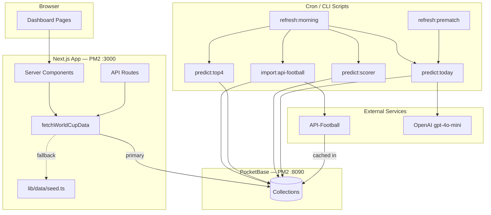

# World Cup Predictor — Developer Handoff

**Product name:** PitchIQ  
**Repository:** [JackB2003/World_Cup_Predictor](https://github.com/JackB2003/World_Cup_Predictor)  
**Production URL:** `https://jackhost.shop/world-cup`  
**Last updated:** June 2026

This document is the primary onboarding guide for developers joining the project. It explains what was built, how it works, and how to run, extend, and deploy it.

For the original product spec, see [`ai_world_cup_predictor_project_requirements.md`](./ai_world_cup_predictor_project_requirements.md).  
For VPS/IT operations, see [`IT_SPECIALIST_POST_BUILD_HANDOFF.md`](./IT_SPECIALIST_POST_BUILD_HANDOFF.md) and [`VPS_SETUP_BRIEF.md`](./VPS_SETUP_BRIEF.md).

---

## Table of contents

1. [What this application is](#1-what-this-application-is)
2. [Architecture at a glance](#2-architecture-at-a-glance)
3. [Tech stack](#3-tech-stack)
4. [Repository structure](#4-repository-structure)
5. [How data flows through the system](#5-how-data-flows-through-the-system)
6. [PocketBase data layer](#6-pocketbase-data-layer)
7. [Prediction engine](#7-prediction-engine)
8. [External integrations](#8-external-integrations)
9. [Scripts and refresh pipeline](#9-scripts-and-refresh-pipeline)
10. [Frontend and pages](#10-frontend-and-pages)
11. [API routes](#11-api-routes)
12. [Design prototype (`design/`)](#12-design-prototype-design)
13. [Environment variables](#13-environment-variables)
14. [Local development](#14-local-development)
15. [Production deployment](#15-production-deployment)
16. [Troubleshooting](#16-troubleshooting)
17. [Known gaps and future work](#17-known-gaps-and-future-work)
18. [Quick reference](#18-quick-reference)

---

## 1. What this application is

PitchIQ is an AI-assisted FIFA World Cup 2026 prediction dashboard built for a company World Cup competition. It is **not** a gambling or live in-game betting product.

### Core features (MVP)

| Feature | Type | Description |
|---------|------|-------------|
| **Top 4 predictor** | One-time | Monte Carlo tournament simulation → title / top-4 / advance probabilities |
| **Top scorer predictor** | One-time | Golden Boot projections ranked by projected goals |
| **Daily match predictions** | Recurring | Pre-match winner/draw, score, confidence, reasoning, risk factors |
| **Dashboard** | UI | Overview, picks, outlook, scorer, news, and accuracy tracker views |

### What it deliberately does *not* do (MVP)

- Live match tracking or in-game prediction updates
- Public user accounts or multiplayer
- Direct browser calls to API-Football or OpenAI (all external APIs are server-side)
- Vercel deployment (runs on a self-hosted VPS)

### Hosting model

- **Next.js app** — PM2 process on Ubuntu VPS, proxied by Nginx at `/world-cup`
- **PocketBase** — separate PM2 process on `127.0.0.1:8090` (not restarted on app deploys)
- **CI/CD** — GitHub Actions SSH deploy on push to `main`

---

## 2. Architecture at a glance



### Layer responsibilities

| Layer | Location | Responsibility |
|-------|----------|----------------|
| **UI** | `app/`, `components/` | Server-rendered dashboard; client views for interactivity |
| **Domain logic** | `features/` | Pure prediction/simulation algorithms (no UI, no I/O) |
| **Data access** | `lib/data/`, `lib/pocketbase/` | Read path for UI; PocketBase clients and mappers |
| **Integrations** | `lib/api-football/`, `lib/openai/` | External API clients with caching and rate limiting |
| **Jobs** | `scripts/` | One-off setup, seeding, imports, predictions, cron pipelines |
| **Types** | `types/world-cup.ts` | Shared contracts between all layers |

### Import boundaries (enforced by Fallow)

```
app        → components, features, lib, types
components → lib, types
features   → lib, types
scripts    → features, lib, types
```

Configured in `.fallowrc.json`. `design/` and `fixtures/` are excluded from audits.

---

## 3. Tech stack

| Layer | Choice | Version (approx.) |
|-------|--------|-------------------|
| Framework | Next.js App Router | 15.3 |
| UI | React + Tailwind CSS | 19 / 4 |
| Language | TypeScript | 5.8 |
| Database | PocketBase | 0.26 |
| External APIs | API-Football, OpenAI | — |
| Script runner | tsx | 4.x |
| Process manager | PM2 | VPS |
| Reverse proxy | Nginx | VPS |
| Code quality | Fallow | PR checks only |

**Build output:** `output: "standalone"` in `next.config.ts` for VPS deployment.  
**URL base path:** `/world-cup` — all routes and assets are prefixed.

---

## 4. Repository structure

```
World_Cup_Predictor/
├── app/                          # Next.js App Router
│   ├── layout.tsx                # Root layout, fonts, ThemeProvider
│   ├── globals.css               # Design tokens (from design/styles.css)
│   ├── (dashboard)/              # Dashboard route group
│   │   ├── layout.tsx            # Fetches data, wraps AppShell
│   │   ├── page.tsx              # Redirects → /overview
│   │   ├── overview/page.tsx
│   │   ├── picks/page.tsx
│   │   ├── outlook/page.tsx
│   │   ├── scorer/page.tsx
│   │   ├── news/page.tsx
│   │   └── tracker/page.tsx
│   └── api/                      # Server API routes
│       ├── health/route.ts
│       ├── world-cup/route.ts
│       ├── teams/route.ts
│       ├── matches/today/route.ts
│       └── refresh/route.ts
│
├── components/
│   ├── layout/app-shell.tsx      # Sidebar, topbar, nav, refresh button
│   ├── views/                    # Page-level view components
│   ├── ui/primitives.tsx         # Crest, ProbBar, FormRow, etc.
│   └── providers/theme-provider.tsx
│
├── features/                     # Domain logic (pure functions)
│   ├── predictions/match-engine.ts
│   ├── simulation/monte-carlo.ts
│   ├── scorer/projections.ts
│   └── team-strength.ts
│
├── lib/
│   ├── data/
│   │   ├── service.ts            # ★ Primary read path for all UI/API
│   │   └── seed.ts               # Static fallback dataset
│   ├── pocketbase/
│   │   ├── admin.ts              # Admin + public PB clients, .env loader
│   │   ├── collections.ts        # Collection name constants
│   │   └── mappers.ts            # PB records → app types
│   ├── api-football/client.ts    # API-Football with mock/cache/rate limits
│   ├── openai/reasoning.ts       # Optional GPT reasoning enhancement
│   ├── scripts/fallback.ts       # PB-unavailable fallback for scripts
│   ├── base-path.ts              # Must match next.config.ts basePath
│   └── utils.ts
│
├── scripts/                      # CLI jobs (run via npm scripts + tsx)
├── types/world-cup.ts            # Shared TypeScript interfaces
├── design/                       # Original HTML/React prototype (reference only)
├── fixtures/api-football/        # Mock API-Football JSON responses
├── docs/                         # Requirements, IT handoff, this document
└── .github/workflows/
    ├── deploy.yml                # Push to main → VPS deploy
    └── fallow.yml                # PR code-quality audit
```

---

## 5. How data flows through the system

### Read path (what the UI sees)

Every dashboard page and API route calls **`fetchWorldCupData()`** in `lib/data/service.ts`. This is the single source of truth for rendered data.

```
Page/API request
  → fetchWorldCupData()
      1. If USE_SEED_DATA=true OR POCKETBASE_URL unset → return SEED_DATA (in-memory mock)
      2. Else query PocketBase collections in parallel
      3. Join predictions onto matches; build teamMap
      4. Filter today's matches (or fall back to first 5)
      5. On any error → silently return SEED_DATA
  → Pass WorldCupData to Server Component or JSON response
```

**Important:** The app can appear fully functional while still showing placeholder data. There is no UI indicator when the seed fallback is active.

### Write path (how data gets into PocketBase)

Data is written exclusively by **CLI scripts** (`scripts/`), not by the Next.js UI:

1. `setup:pb` — create collections (one-time)
2. `seed` — load design mock data into PocketBase
3. `import:api-football` — pull real fixtures from API-Football
4. `predict:*` — run engines and upsert predictions
5. `refresh:morning` / `refresh:prematch` — orchestrate the above on a schedule

### Distinguishing mock vs live data

| Signal | Mock / seed | Live |
|--------|-------------|------|
| Match IDs | `m1`, `m2`, … | `af-{fixtureId}` |
| `meta.lastUpdate` | `"7:02 AM"` (hardcoded) | Dynamic timestamp from scripts |
| API usage (`/api/health`) | `used: 0` | Increments with live API calls |
| `API_FOOTBALL_MOCK` | `true` | `false` |

---

## 6. PocketBase data layer

### Running PocketBase

PocketBase is a **separate process** from the Next.js app:

```bash
# Production (already configured on VPS)
pm2 start ./pocketbase --name pocketbase -- serve --http=127.0.0.1:8090

# Local
./pocketbase serve --http=127.0.0.1:8090
```

Admin UI: `http://127.0.0.1:8090/_/` (use SSH tunnel in production).

Data directory on VPS: `/var/www/pocketbase/pb_data/` — **never delete during deploys**.

### Collections

Defined in `lib/pocketbase/collections.ts`, created by `npm run setup:pb`:

| Collection | Purpose | Populated by |
|------------|---------|--------------|
| `teams` | Elo, FIFA rank, form, probabilities | `seed`, `predict:top4` |
| `players` | Player records | Schema only — not wired yet |
| `matches` | Fixtures, kickoff, scores | `seed`, `import:api-football` |
| `standings` | Group standings | Schema only |
| `injuries` | Injury records | Schema only |
| `predictions` | Per-match AI picks | `seed`, `predict:today` |
| `prediction_history` | Graded pick history | `grade:picks` |
| `scorers` | Golden Boot projections | `seed`, `predict:scorer` |
| `news` | Injury/lineup/odds alerts | `seed` (manual/API TBD) |
| `user_picks` | Demo user competition stats | `seed`, `grade:picks` |
| `meta` | JSON blobs (`dashboard`, `modelWeights`) | `seed`, prediction scripts |
| `tournament_predictions` | Monte Carlo / scorer run snapshots | `predict:top4`, `predict:scorer` |
| `api_request_logs` | Daily API-Football request counter | `lib/api-football/client.ts` |
| `data_refresh_logs` | Cron refresh audit trail | `refresh:morning` |
| `api_cache` | Cached API-Football responses | `lib/api-football/client.ts` |

### Access rules

Collections are created with **public read** (`listRule=""`, `viewRule=""`). Writes require admin authentication via `ensureAdminAuth()` in scripts.

Security relies on PocketBase binding to localhost in production — it is not exposed to the public internet.

### Mappers (`lib/pocketbase/mappers.ts`)

- `mapTeamRecord()` — PocketBase `teams` → `Team`
- `mapScorerRecord()` — PocketBase `scorers` → `Scorer` (maps `teamCode` → `team`, `position` → `pos`)

### Seed data (`lib/data/seed.ts`)

Static `SEED_DATA` matching the `WorldCupData` type:

- 18 teams, 5 matches, 8 scorers, 6 news items
- User picks, model weights, dashboard meta
- Origin: ported from `design/data.js`

Loaded into PocketBase by `npm run seed`. **Note:** seeding PocketBase with mock data produces the same content as the in-memory fallback — the UI will look identical either way.

### PocketBase clients (`lib/pocketbase/admin.ts`)

- `getPublicPocketBase()` — unauthenticated reads (used by `fetchWorldCupData`)
- `ensureAdminAuth()` — authenticates as admin for write scripts
- `loadEnvFile()` — manually parses `.env` for tsx CLI scripts (Next.js does not auto-load env for standalone CLI runs)

---

## 7. Prediction engine

All prediction logic lives in `features/` as pure functions. Scripts orchestrate I/O; engines do the math.

### Daily match predictions — `predict:today`

**Script:** `scripts/predict-today.ts`  
**Engine:** `features/predictions/match-engine.ts`

```
Load teams, matches, news from PocketBase
  → For each match today (or first 5 if none today):
      predictMatch(home, away, news)
        • teamPower(): Elo, form, xG, defense, host boost, injury penalties
        • Win/draw/away probabilities
        • Pick, score, confidence, tag, template reasons/risk
      enhancePredictionReasoning() [lib/openai/reasoning.ts]
        • If OPENAI_API_KEY set: gpt-4o-mini returns JSON { reasons, risk }
        • On failure or no key: keeps deterministic template strings
      Upsert into predictions collection
  → Update meta.lastUpdate
```

### Top 4 tournament — `predict:top4`

**Script:** `scripts/predict-top4.ts`  
**Engine:** `features/simulation/monte-carlo.ts`

```
Load teams from PocketBase (or SEED_DATA fallback)
  → runMonteCarlo(teams, 10000)
      • Group round-robin → knockout bracket
      • Title / top-4 / advance probabilities
  → Update teams.titleProb, top4, advance
  → Insert tournament_predictions { type: "top4" }
```

Uses `runWithPocketBaseFallback()` — if PocketBase is down, runs locally and logs only.

### Top scorer — `predict:scorer`

**Script:** `scripts/predict-scorer.ts`  
**Engine:** `features/scorer/projections.ts`

```
Load scorers + teams from PocketBase (or SEED_DATA fallback)
  → rankScorers()
      • Score = projectedMatches × minutes × g90 × pen bonus × group difficulty × injury modifiers
  → Update scorers.proj, prob
  → Insert tournament_predictions { type: "top_scorer" }
```

### Grading picks — `grade:picks`

**Script:** `scripts/grade-picks.ts`

Recomputes user accuracy, points, and streak from `prediction_history`. Not yet in the cron schedule — run manually after match results are known.

---

## 8. External integrations

### API-Football

**Client:** `lib/api-football/client.ts`  
**Base URL:** `https://v3.football.api-sports.io`  
**Auth:** `x-apisports-key` header (server-side only)

#### Mock vs live

| Mode | Env | Behavior |
|------|-----|----------|
| **Mock** (default) | `API_FOOTBALL_MOCK=true` | Reads JSON from `fixtures/api-football/{cacheKey}.json` |
| **Live** | `API_FOOTBALL_MOCK=false` + `API_FOOTBALL_KEY` | Real HTTP fetch with PocketBase caching |

`refresh:morning` and `refresh:prematch` skip live import when mock mode is enabled.

#### Caching

Live responses are cached in the `api_cache` PocketBase collection:

- Cache key: `endpoint?sorted_params`
- TTL varies by endpoint (fixtures: 2h, standings: 6h, teams/leagues: 168h, etc.)
- Stale entries are deleted and replaced on new fetch

#### Rate limiting

- **Daily limit:** 100 requests
- **Warn threshold:** 95 — throws before making a new request
- Each live request logged to `api_request_logs`
- Usage exposed via `GET /world-cup/api/health` and `GET /world-cup/api/refresh`

#### Wrapped endpoints

`fixtures`, `standings`, `teams`, `topScorers`, `injuries`, `predictions`, `leagues`

#### Known import limitation

`import-api-football.ts` derives team codes as `team.name.slice(0, 3).toUpperCase()`, which may not match FIFA 3-letter codes (e.g. `"United States"` → `"UNI"`). This should be fixed before go-live with a proper team-code mapping table.

### OpenAI

**Client:** `lib/openai/reasoning.ts`  
**Model:** `gpt-4o-mini`  
**Usage:** Optional enhancement of match prediction reasons and risk text  
**Fallback:** Deterministic template strings when key is missing or call fails

---

## 9. Scripts and refresh pipeline

### npm scripts

| Script | File | Purpose |
|--------|------|---------|
| `dev` | — | `next dev` → `http://localhost:3000/world-cup` |
| `build` | — | Production build (standalone output) |
| `start` | — | `next start` (production) |
| `lint` | — | ESLint |
| `setup:pb` | `scripts/setup-pocketbase.ts` | One-time PocketBase collection creation |
| `seed` | `scripts/seed-pocketbase.ts` | Wipe + seed PocketBase from `SEED_DATA` |
| `predict:top4` | `scripts/predict-top4.ts` | Monte Carlo → team probabilities |
| `predict:scorer` | `scripts/predict-scorer.ts` | Scorer rankings |
| `predict:today` | `scripts/predict-today.ts` | Today's match predictions |
| `refresh:morning` | `scripts/morning-refresh.ts` | Full daily pipeline |
| `refresh:prematch` | `scripts/prematch-refresh.ts` | Pre-kickoff refresh |
| `import:api-football` | `scripts/import-api-football.ts` | Pull fixtures → `matches` |
| `grade:picks` | `scripts/grade-picks.ts` | Recompute user accuracy |
| `fallow:audit` | — | Local code-quality audit |

### Morning refresh pipeline

`npm run refresh:morning` runs:

1. Log current API usage
2. If not mock: `import:api-football`
3. `predict:top4`
4. `predict:scorer`
5. `predict:today`
6. Write `data_refresh_logs` entry

### Pre-match refresh pipeline

`npm run refresh:prematch` runs:

1. If matches today and not mock: fetch injuries + today's fixtures
2. `predict:today`

### Cron schedule (production)

Template in `scripts/cron.example` — install on the `deploy` user's crontab:

| Schedule | Command | Purpose |
|----------|---------|---------|
| `0 6 * * *` | `refresh:morning` | Daily data + predictions |
| `30 11 * * *` | `refresh:prematch` | Pre-kickoff update (~90 min before first match) |
| `0 3 * * *` | PocketBase backup tar | `/var/backups/pocketbase-YYYYMMDD.tar.gz` |

Logs: `/var/log/world-cup-refresh.log`

### Manual refresh from UI

The Refresh button in `AppShell` calls `POST /world-cup/api/refresh` with `{ confirm: true }`, which spawns `npm run refresh:morning` via `child_process.exec` (120s timeout).

Protected by optional `ADMIN_REFRESH_TOKEN` (Bearer auth). If unset, the endpoint is unauthenticated.

---

## 10. Frontend and pages

### Routing

All pages live under the `(dashboard)` route group. With `basePath: "/world-cup"`:

| Page | URL | View component |
|------|-----|----------------|
| Home | `/world-cup` | Redirects to `/world-cup/overview` |
| Overview | `/world-cup/overview` | `OverviewView` |
| Picks | `/world-cup/picks` | `PicksView` |
| Outlook | `/world-cup/outlook` | `OutlookView` |
| Scorer | `/world-cup/scorer` | `ScorerView` |
| News | `/world-cup/news` | `NewsView` |
| Tracker | `/world-cup/tracker` | `TrackerView` |

### Rendering model

- All pages are **React Server Components**
- Each page calls `fetchWorldCupData()` and passes data to a client view in `components/views/`
- `app/(dashboard)/layout.tsx` also fetches data for the shell (nav badges, meta, refresh state)

### Layout and theming

- `components/layout/app-shell.tsx` — sidebar navigation, top bar, refresh control
- `components/providers/theme-provider.tsx` — dark/light mode (from design prototype)
- `app/globals.css` — CSS custom properties / design tokens
- `components/ui/primitives.tsx` — shared UI atoms (Crest, ProbBar, FormRow, etc.)

### basePath handling

`lib/base-path.ts` exports `basePath = "/world-cup"`. This **must** match `next.config.ts`. Used by client-side fetch calls (e.g. refresh button).

---

## 11. API routes

All API routes are prefixed with `/world-cup` in production.

| Route | Methods | Purpose |
|-------|---------|---------|
| `/api/health` | GET | App health + API-Football daily usage |
| `/api/world-cup` | GET | Full `WorldCupData` JSON |
| `/api/teams` | GET | Teams array |
| `/api/matches/today` | GET | Today's matches (or first 5 fallback) |
| `/api/refresh` | GET, POST | Usage check; trigger morning refresh |

**Health check example:**

```bash
curl -s http://127.0.0.1:3000/world-cup/api/health
# {"status":"ok","timestamp":"...","apiFootball":{"used":0,"limit":100}}
```

---

## 12. Design prototype (`design/`)

The `design/` folder is the **original PitchIQ HTML/React prototype**. It is reference-only and excluded from Fallow audits.

| Design file | Production equivalent |
|-------------|----------------------|
| `design/data.js` | `lib/data/seed.ts` |
| `design/styles.css` | `app/globals.css` |
| `design/components.jsx` | `components/ui/primitives.tsx` |
| `design/overview.jsx`, etc. | `components/views/*.tsx` |
| `design/app.jsx` | `components/layout/app-shell.tsx` + dashboard layout |
| `design/tweaks-panel.jsx` | `theme-provider.tsx` (theme only; no tweaks UI panel) |
| `design/README.md` | Full UI/UX spec (tokens, IA, interactions) |

**Do not ship or import design files directly.** They use Babel-in-browser and `window` globals.

---

## 13. Environment variables

Copy `.env.example` to `.env` for local development. On the VPS, the file lives at `/var/www/world-cup-predictor/.env` (mode `600`, never commit).

| Variable | Required | Default | Purpose |
|----------|----------|---------|---------|
| `NODE_ENV` | No | `development` | Node environment |
| `PORT` | No | `3000` | Next.js listen port |
| `POCKETBASE_URL` | For live data | `http://127.0.0.1:8090` | PocketBase API URL |
| `POCKETBASE_ADMIN_EMAIL` | For scripts | — | Admin auth for write scripts |
| `POCKETBASE_ADMIN_PASSWORD` | For scripts | — | Admin auth for write scripts |
| `API_FOOTBALL_KEY` | Live mode | — | API-Football key (**server-only**) |
| `API_FOOTBALL_MOCK` | No | `true` | `true` = fixture files; `false` = live API |
| `WORLD_CUP_LEAGUE_ID` | No | `1` | League ID for imports |
| `WORLD_CUP_SEASON` | No | `2026` | Season year |
| `OPENAI_API_KEY` | No | — | Optional reasoning enhancement |
| `ADMIN_REFRESH_TOKEN` | No | — | Bearer token for `POST /api/refresh` |
| `USE_SEED_DATA` | No | — | Force in-memory seed; skip PocketBase entirely |

**Deploy shell variables** (not in app `.env`):

| Variable | Default | Purpose |
|----------|---------|---------|
| `DEPLOY_PATH` | `/var/www/world-cup-predictor` | Deploy script working directory |
| `PM2_APP_NAME` | `world-cup-predictor` | PM2 process name |

**GitHub Actions secrets:** `SSH_HOST`, `SSH_USER`, `SSH_PRIVATE_KEY`, `SSH_PORT`, `DEPLOY_PATH`, `PM2_APP_NAME`

After any `.env` change on the VPS:

```bash
pm2 restart world-cup-predictor
```

---

## 14. Local development

### Prerequisites

- Node.js 20+ (22 LTS recommended)
- npm

### Quick start (no PocketBase)

```bash
git clone https://github.com/JackB2003/World_Cup_Predictor.git
cd World_Cup_Predictor
npm install
cp .env.example .env
# Leave POCKETBASE_URL unset, or set USE_SEED_DATA=true
npm run dev
```

Open: `http://localhost:3000/world-cup/overview`

### Full local stack (with PocketBase)

1. Download [PocketBase](https://pocketbase.io/docs/) and run:

   ```bash
   ./pocketbase serve --http=127.0.0.1:8090
   ```

2. Create admin at `http://127.0.0.1:8090/_/`

3. Configure `.env`:

   ```env
   POCKETBASE_URL=http://127.0.0.1:8090
   POCKETBASE_ADMIN_EMAIL=your@email.com
   POCKETBASE_ADMIN_PASSWORD=yourpassword
   ```

4. Initialize data:

   ```bash
   npm run setup:pb    # one-time
   npm run seed
   npm run predict:top4
   npm run predict:scorer
   npm run predict:today
   ```

5. Start dev server:

   ```bash
   npm run dev
   ```

### Testing live API-Football locally

```env
API_FOOTBALL_MOCK=false
API_FOOTBALL_KEY=your_key_here
```

Then run `npm run import:api-football`. Requires PocketBase for caching and request logging.

### Code quality

```bash
npm run lint
npm run fallow:audit
```

Fallow also runs automatically on pull requests via GitHub Actions.

---

## 15. Production deployment

### Infrastructure

| Component | Path / detail |
|-----------|---------------|
| App code | `/var/www/world-cup-predictor` |
| PocketBase data | `/var/www/pocketbase/pb_data/` |
| PM2 app process | `world-cup-predictor` → `npm start` on port 3000 |
| PM2 PB process | `pocketbase` → `127.0.0.1:8090` |
| Nginx | Proxies `/world-cup` → `127.0.0.1:3000` |
| Public URL | `https://jackhost.shop/world-cup` |

### Deploy flow

Push to `main` triggers `.github/workflows/deploy.yml`:

```
GitHub Actions (SSH)
  → cd $DEPLOY_PATH
  → bash scripts/deploy.sh
      git pull origin main
      npm ci
      npm run build
      pm2 restart world-cup-predictor
```

PocketBase is **not** restarted during app deploys.

### First-time production data setup

After PocketBase admin credentials are in `.env`:

```bash
cd /var/www/world-cup-predictor
npm run setup:pb
npm run seed

# When ready for live API data:
# Set API_FOOTBALL_MOCK=false in .env
npm run import:api-football
npm run predict:top4
npm run predict:scorer
npm run predict:today

pm2 restart world-cup-predictor
```

### Nginx configuration

The app uses `basePath: "/world-cup"`. Nginx must proxy the subpath:

```nginx
location /world-cup {
    proxy_pass http://127.0.0.1:3000;
    proxy_http_version 1.1;
    proxy_set_header Host $host;
    proxy_set_header X-Real-IP $remote_addr;
    proxy_set_header X-Forwarded-For $proxy_add_x_forwarded_for;
    proxy_set_header X-Forwarded-Proto $scheme;
}
```

### Verify production

```bash
pm2 list
curl -s http://127.0.0.1:3000/world-cup/api/health
curl -sI https://jackhost.shop/world-cup/overview
```

### Go-live checklist

- [ ] PocketBase admin created; credentials in `.env`
- [ ] `npm run setup:pb` and `npm run seed` completed
- [ ] `API_FOOTBALL_MOCK=false` when live integration is confirmed
- [ ] `import:api-football` and prediction scripts run successfully
- [ ] Cron jobs installed from `scripts/cron.example`
- [ ] PocketBase backup cron active; `/var/backups/` has space
- [ ] `ADMIN_REFRESH_TOKEN` set before exposing refresh endpoint publicly
- [ ] Domain DNS + SSL configured
- [ ] GitHub Actions SSH key rotated after first successful deploy

---

## 16. Troubleshooting

### Site shows placeholder / mock data

The most common production issue. Two bugs caused this in production (June 2026):

1. **`user_picks` sort on a view collection** — `user_picks` is a PocketBase view (no `created` field). `getFullList({ sort: "-created" })` returns HTTP 400, which hit the silent `catch` in `fetchWorldCupData()` and always returned `SEED_DATA`. Fix: use `getFullList()` with no sort on `userPicks`.
2. **Static pre-render at build time** — Dashboard layout and `/api/world-cup` lacked `export const dynamic = "force-dynamic"`, so Next.js 15 baked seed HTML into the build. Fix: add `force-dynamic` to `app/(dashboard)/layout.tsx` and `app/api/world-cup/route.ts`.

The catch block now logs `[fetchWorldCupData] PocketBase fetch failed...` to server logs instead of failing silently.

If data still looks wrong after those fixes, check in order:

1. **Is PocketBase reachable?**
   ```bash
   pm2 list   # pocketbase should be "online"
   curl -s http://127.0.0.1:8090/api/health
   ```

2. **Is `POCKETBASE_URL` set and picked up?**
   ```bash
   grep POCKETBASE_URL /var/www/world-cup-predictor/.env
   pm2 restart world-cup-predictor
   ```

3. **Was data pipeline run?** Updating `.env` alone does not populate data.
   ```bash
   npm run setup:pb && npm run seed
   npm run import:api-football   # requires API_FOOTBALL_MOCK=false
   npm run predict:top4 && npm run predict:scorer && npm run predict:today
   ```

4. **Is mock mode still on?**
   ```bash
   grep API_FOOTBALL_MOCK /var/www/world-cup-predictor/.env
   # Should be "false" for live data
   ```

5. **Check for seed fingerprint in API response:**
   ```bash
   curl -s http://127.0.0.1:3000/world-cup/api/world-cup | grep lastUpdate
   # "7:02 AM" = still showing hardcoded seed data
   # Match IDs "m1", "m2" = seed; "af-12345" = API-Football import
   ```

### `/api/health` returns 404

Use the full basePath: `/world-cup/api/health`, not `/api/health`.

### Scripts fail with auth errors

Ensure `POCKETBASE_ADMIN_EMAIL` and `POCKETBASE_ADMIN_PASSWORD` are set in `.env`. Scripts use `ensureAdminAuth()` which authenticates against `_superusers`.

### API-Football rate limit hit

Check usage: `curl -s http://127.0.0.1:3000/world-cup/api/health`. Daily limit is 100 requests. Review `api_request_logs` in PocketBase admin.

### Deploy fails

See [`IT_SPECIALIST_POST_BUILD_HANDOFF.md`](./IT_SPECIALIST_POST_BUILD_HANDOFF.md) for SSH key setup and GitHub Actions secrets.

---

## 17. Known gaps and future work

These are intentional MVP limitations or incomplete wiring:

| Gap | Detail | Suggested next step |
|-----|--------|---------------------|
| **Partial API import** | Only `matches` imported from API-Football | Wire `players`, `standings`, `injuries` collections |
| **Team code mapping** | Import uses first 3 chars of team name | Add FIFA code lookup table |
| **News ingestion** | News only from seed data | Integrate injuries API + manual news pipeline |
| **Silent seed fallback** | No UI indicator when showing mock data | Add `dataSource` to `/api/health` |
| **grade:picks not cronned** | Manual run only | Add post-match cron once results import exists |
| **Refresh endpoint auth** | Unauthenticated if `ADMIN_REFRESH_TOKEN` unset | Set token before go-live |
| **User accounts** | Single demo `user_picks` record | Out of MVP scope |
| **Live match features** | Excluded from MVP | See requirements doc |

---

## 18. Quick reference

### Key files to read first

1. `lib/data/service.ts` — how the UI gets data
2. `types/world-cup.ts` — data contracts
3. `features/predictions/match-engine.ts` — match prediction logic
4. `scripts/morning-refresh.ts` — daily pipeline
5. `next.config.ts` — basePath and standalone output
6. `components/layout/app-shell.tsx` — app shell and navigation

### Common commands

```bash
# Local dev
npm run dev

# Initialize PocketBase
npm run setup:pb && npm run seed

# Run all predictions
npm run predict:top4 && npm run predict:scorer && npm run predict:today

# Full refresh (what cron runs)
npm run refresh:morning

# Production deploy (automatic on push to main, or manual)
bash scripts/deploy.sh
```

### Related documentation

| Document | Audience | Purpose |
|----------|----------|---------|
| `DEVELOPER_HANDOFF.md` (this file) | Developers | Architecture, code, workflows |
| `ai_world_cup_predictor_project_requirements.md` | Product / dev | Full spec and data model |
| `IT_SPECIALIST_POST_BUILD_HANDOFF.md` | IT / ops | VPS setup, env, cron, SSH |
| `IT_SPECIALIST_REMAINING_TASKS.md` | IT / ops | Outstanding infra tasks |
| `VPS_SETUP_BRIEF.md` | IT / ops | Initial server provisioning |
| `design/README.md` | Design / frontend | UI tokens, layout, interactions |
| `.env.example` | All | Environment variable template |

---

*Questions or gaps in this document? Update it as the codebase evolves — future developers depend on it being accurate.*
