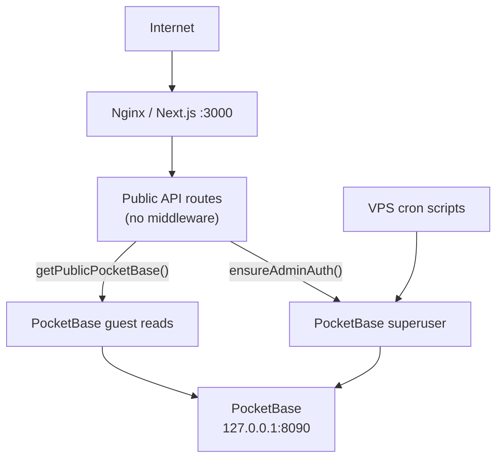
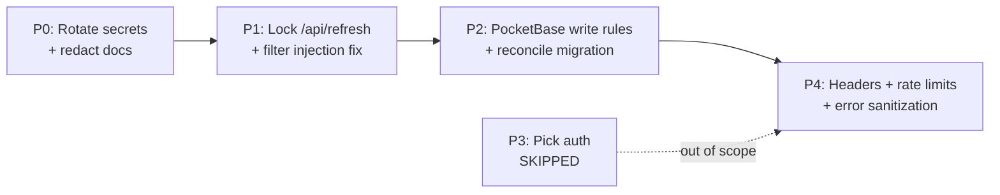

# Site Security Hardening Plan

**Status:** IT Specialist approved — ready for implementation  
**Date:** June 10, 2026  
**Approved scope:** P0, P1, P2, P4 (P3 pick-write auth explicitly out of scope)

---

## Approved scope

**In scope:** P0, P1, P2, P4  
**Out of scope:** P3 (pick write authentication)

### P0 credential rotation — handoff workflow

**Developer (code deploy):**
1. Redact live secrets from `docs/IT_SPECIALIST_POST_BUILD_HANDOFF.md` (placeholders only)
2. Deploy P1–P4 code changes to production
3. Generate new credential values (PocketBase admin password, API-Football key, OpenAI key, `ADMIN_REFRESH_TOKEN`)
4. Share new values securely with IT Specialist (not via git)

**IT Specialist (ops, after deploy):**
1. Update `/var/www/world-cup-predictor/.env` with new values (ordered PocketBase rotation — see §4 below)
2. `pm2 restart world-cup-predictor --update-env` (as **deploy** user: `sudo -u deploy pm2 list`)
3. Verify app and cron auth

Developer does **not** commit or push new credential values to the repo.

---

### Implementation checklist

| Phase | Task | Owner | Status |
|-------|------|-------|--------|
| P0 | Redact secrets in repo docs; share new credential values with IT post-deploy | Dev → IT | Pending |
| P1 | Lock `POST /api/refresh`, remove Refresh button, fix filter injection | Dev | Pending |
| P2 | PocketBase write rules → superuser-only; reconcile existing collections | Dev + IT | Pending |
| P3 | Pick write auth | — | **Skipped** |
| P4 | Security headers, rate limiting, health endpoint trim, public pick reads | Dev + IT | Pending |
| Ops | PM2 under deploy user; morning cron `cd` prefix | IT | **Done** |

---

## Current security posture

This is a **public read-only dashboard** with **no user authentication**. Security today relies primarily on:

- PocketBase bound to `127.0.0.1:8090` (confirmed localhost-only)
- Server-only env vars (no `NEXT_PUBLIC_*` secrets)
- Cron/PM2 scripts for data refresh



**What is already in good shape:**

- No `dangerouslySetInnerHTML`, `eval`, or `innerHTML` usage
- React text rendering for news/picks (XSS-safe)
- API keys used only server-side (`lib/api-football/client.ts`, `lib/openai/reasoning.ts`)
- `.env` is gitignored; deploy uses GitHub Actions secrets for SSH
- Fallow audit runs in CI (`.fallowrc.json`)

---

## User-facing impact (will the site work the same?)

**Short answer:** Most visitors will notice no change. The dashboard, predictions, news, tracker, and **pick submission** all keep working as today. The only deliberate UX change is removing the manual Refresh button.

### No visible change (safe to do)

| Change | Why it is invisible |
|--------|---------------------|
| P0 — Rotate secrets + redact docs | Ops-only; update `.env` on VPS with new keys. Site keeps running. |
| P2 — PocketBase write rules → `null` | Next.js and cron scripts still use admin auth. Public **reads** unchanged. |
| P1 — Filter injection fix | Only rejects invalid `matchId` values. Normal picks use `m1`, `af-123`, etc. — unaffected. |
| P4 — Public pick reads via guest client | Same data returned; uses `getPublicPocketBase()` instead of superuser for reads. |
| P4 — Security headers | Browsers enforce extra policies; no UI change expected (CSP starts report-only). |
| P4 — Rate limiting | 10 picks/min is far above normal use for one person. |
| P4 — Health endpoint trim | Nothing on the dashboard reads API quota from `/api/health`. |
| VPS verification | Infrastructure only. |

### One intentional UX change (P1)

| What changes | Before | After |
|--------------|--------|-------|
| **Refresh button** in sidebar (`components/layout/app-shell.tsx`) | Anyone can click to trigger a full data import | Button removed |

**Data still updates automatically** via VPS cron (`refresh:morning` at 6 AM, `refresh:prematch` at 11:30 AM). You lose on-demand manual refresh from the browser — use SSH + cron script if you ever need an ad-hoc refresh.

### Unchanged — P3 skipped

| What stays the same | Notes |
|---------------------|-------|
| **Submitting daily picks** | `POST /api/picks` remains open; no login or password required |
| **Viewing tracker / picks** | Unchanged |

`lib/picks/client.ts` localStorage fallback behavior is unchanged.

---

## Critical findings (fix first)

### 1. Live credentials committed in docs

`docs/IT_SPECIALIST_POST_BUILD_HANDOFF.md` (lines ~155–169) contains real values for:

- `POCKETBASE_ADMIN_PASSWORD`
- `API_FOOTBALL_KEY`
- `OPENAI_API_KEY`
- Plus VPS IP and deploy paths

**Actions (ops, not code):**

1. Rotate **all** exposed credentials on the VPS immediately (PocketBase admin password, API-Football key, OpenAI key)
2. Redact the doc to placeholders (`your_password_here`, etc.)
3. Audit git history (`git log -p -- docs/IT_SPECIALIST_POST_BUILD_HANDOFF.md`) and consider `git filter-repo` or BFG if the repo was ever public
4. Add a pre-commit or CI grep check blocking `sk-proj-`, `POCKETBASE_ADMIN_PASSWORD=`, etc. in tracked files

---

### 2. Unauthenticated admin refresh endpoint

`app/api/refresh/route.ts` runs `npm run refresh:morning` via `child_process.exec`. Auth is **optional** — when `ADMIN_REFRESH_TOKEN` is unset (default in `.env.example`), anyone can trigger expensive imports.

The UI button in `components/layout/app-shell.tsx` calls this endpoint **without** a Bearer token, so even setting the token today would break the button.

**Recommended fix:**

- **Fail closed in production**: reject `POST /api/refresh` with `401` when `ADMIN_REFRESH_TOKEN` is missing or auth header is wrong
- **Remove the public Refresh button** from the UI (cron already handles refresh via `scripts/cron.example`)
- Return generic error messages in production (`"Refresh failed"`) instead of `String(err)` (line 41)
- Optionally restrict `GET /api/refresh` and `app/api/health/route.ts` to internal/cron use or remove quota details from public responses

---

### 3. PocketBase filter injection

`lib/picks/store.ts` interpolates user `matchId` values directly into filter strings (lines 43–45, 55, 92). A crafted value like `x" || id != "` can alter query logic.

**Fix:**

- Add a shared validator in `lib/utils.ts` or `features/picks/daily-picks.ts`:

```ts
const MATCH_ID_RE = /^(m\d+|af-\d+)$/;
function assertValidMatchId(id: string): void { ... }
function escapePbFilterString(s: string): string { return s.replace(/\\/g, "\\\\").replace(/"/g, '\\"'); }
```

- Validate in `app/api/picks/route.ts` before calling store functions
- Validate each ID in the `matchIds` query param array
- Reuse the escape helper everywhere PocketBase filters are built (mirror pattern in `lib/api-football/client.ts:69`)

---

### 4. PocketBase collections allow public writes

`lib/pocketbase/collection-setup.ts` sets `createRule`, `updateRule`, and `deleteRule` to `""` (public). Reads are intentionally public; writes should not be.

Even with localhost-only binding, this is weak defense-in-depth (any local process or SSRF could mutate data).

**Fix:**

- Change write rules to `null` (superuser only) for all collections
- Keep `listRule` / `viewRule` as `""` for collections the app reads publicly via `getPublicPocketBase()`
- Add a `reconcileCollectionRules()` migration step that **updates rules on existing collections** (current code skips existing collections at line 17–20)
- Run `npm run setup:pocketbase` (or equivalent) on VPS after deploy to apply rule changes

---

## P3 — Pick write protection (OUT OF SCOPE)

Deferred per decision: picks remain publicly submittable. Residual risk accepted.

Future option if needed: site-password + httpOnly cookie, or Nginx IP/basic auth on `POST /api/picks`.

---

## High-priority hardening (P4)

### 5. Stop using superuser for routine pick reads

`lib/picks/store.ts` calls `ensureAdminAuth()` for reads and writes. **Reads** switch to `getPublicPocketBase()`; **writes** keep `ensureAdminAuth()` (no login gate — P3 skipped).

This limits blast radius if the Next.js process is compromised, without changing pick submission UX.

### 6. Input validation for pick payloads

In `app/api/picks/route.ts`:

- Validate `matchId` format (regex above)
- Cap `teamNames` keys/values length (e.g. 3-char codes, 50-char names)
- Reject unexpected body fields

Consider a lightweight schema (zod) only for API route bodies — no need to add it project-wide.

### 7. Rate limiting on state-changing endpoints

Add `middleware.ts` at project root with an in-memory limiter (acceptable for single VPS):

| Endpoint | Suggested limit |
|----------|----------------|
| `POST /api/picks` | 10 req/min per IP |
| `POST /api/refresh` | 2 req/hour per IP (or block entirely in prod) |

### 8. Security headers

Add to `next.config.ts` via `headers()`:

```ts
headers: async () => [{
  source: "/:path*",
  headers: [
    { key: "X-Frame-Options", value: "DENY" },
    { key: "X-Content-Type-Options", value: "nosniff" },
    { key: "Referrer-Policy", value: "strict-origin-when-cross-origin" },
    { key: "Permissions-Policy", value: "camera=(), microphone=(), geolocation=()" },
    // CSP: start with report-only, tighten after testing inline styles in primitives.tsx
  ],
}]
```

Also add HSTS in **Nginx** (not Next.js) since TLS terminates there:

`add_header Strict-Transport-Security "max-age=31536000; includeSubDomains" always;`

### 9. CSRF — not required for approved scope

P3 skipped; no session cookies introduced. `POST /api/picks` stays stateless JSON (same as today).

---

## Medium-priority (included in P4 where noted)

### 10. Reduce information disclosure

- `app/api/health/route.ts` — return `{ status: "ok" }` publicly; move API-Football quota to logs
- Standardize API error responses: never return stack traces or `exec` output to clients

### 11. Dependency and static analysis

- Run `npm audit` and `npm run fallow:audit` on a schedule
- Extend Fallow or add a CI step to grep for secret patterns in `docs/` and `scripts/`

### 12. Operational security on VPS (IT Specialist checklist)

Confirm and document (see also `docs/VPS_SETUP_BRIEF.md`):

- [x] **Next.js app running under PM2** (deploy user's daemon — `sudo -u deploy pm2 list`)
- [x] **Morning cron includes `cd /var/www/world-cup-predictor &&`** (fixed by IT)
- [ ] PocketBase `--http=127.0.0.1:8090` (not `0.0.0.0`)
- [ ] No Nginx proxy exposing PocketBase admin UI
- [ ] Firewall: only 80/443 open; 8090 blocked externally
- [ ] PM2 runs as non-root user
- [ ] PocketBase backups encrypted/off-site (`scripts/cron.example`)
- [ ] `ADMIN_REFRESH_TOKEN` set in production `.env`
- [ ] All credentials rotated after P0 (PocketBase, API-Football, OpenAI)
- [ ] HSTS header added in Nginx

### 13. Inline style data from PocketBase (low priority)

`components/ui/primitives.tsx` uses `team.color` / `team.txt` in inline styles. Low XSS risk (no script execution), but attacker-controlled DB data could affect UI. Optional: validate color as hex/CSS-safe on import.

---

## Implementation order



| Phase | Status | Effort | Risk reduced |
|-------|--------|--------|--------------|
| P0 Secrets rotation | **In scope** | ~30 min ops | Credential theft |
| P1 Refresh + injection | **In scope** | ~2 hrs code | Remote command trigger, data query bypass |
| P2 PocketBase ACLs | **In scope** | ~1 hr code + VPS run | Direct DB tampering |
| P3 Pick auth | **Skipped** | — | Pick griefing (accepted) |
| P4 Headers/rate limits | **In scope** | ~2 hrs code | DoS, clickjacking, info leak |

---

## Files to change (code phases)

| File | Changes |
|------|---------|
| `docs/IT_SPECIALIST_POST_BUILD_HANDOFF.md` | Redact secrets |
| `app/api/refresh/route.ts` | Fail closed, sanitize errors |
| `components/layout/app-shell.tsx` | Remove public Refresh button |
| `lib/picks/store.ts` | Validation, escape filters, public reads |
| `app/api/picks/route.ts` | Validate `matchId` / `teamNames` only (no auth gate) |
| `lib/pocketbase/collection-setup.ts` | `null` write rules + reconcile |
| `next.config.ts` | Security headers |
| `middleware.ts` (new) | Rate limiting |
| `.env.example` | Document `ADMIN_REFRESH_TOKEN` required in production |
| `app/api/health/route.ts` | Trim public quota disclosure |

---

## Test plan

After each phase:

1. `npm run build` passes
2. Dashboard pages load with PocketBase data (public reads unchanged)
3. `POST /api/refresh` returns `401` without valid auth in production
4. Crafted `matchId` like `foo" || id != "` returns `400`
5. Direct PocketBase API on localhost: guest can **read** teams/matches, **cannot** create/update/delete
6. Pick submission still works without login (`POST /api/picks` unchanged for legitimate users)
7. `curl -I` on production shows security headers
8. Run `npm run fallow:audit` — no new issues

---

## IT Specialist review (June 2026)

Initial review raised four items. Follow-up corrections noted below.

### 1. Next.js app not under PM2 — **False alarm (resolved)**

**Initial concern:** `pm2 list` as **root** did not show the world-cup app.

**Correction:** The app is properly managed by PM2 under the **deploy user's PM2 daemon**, not root's. To inspect:
```bash
sudo -u deploy pm2 list
```

No action required.

---

### 2. Morning cron missing `cd` — **Fixed by IT**

**Was valid.** The 6 AM line was missing `cd /var/www/world-cup-predictor &&`, causing silent daily failures.

**Status:** Fixed. Crontab now matches [`scripts/cron.example`](scripts/cron.example). Verify after next 6 AM run via `/var/log/world-cup-refresh.log`.

---

### 3. Git history / repo visibility — **Partially urgent; history rewrite optional for now**

**GitHub repo status (checked June 10, 2026):** [github.com/JackB2003/World_Cup_Predictor](https://github.com/JackB2003/World_Cup_Predictor) is **private** today.

| Scenario | Action |
|----------|--------|
| **Always private** | Rotate credentials + redact doc going forward is sufficient. History rewrite (`git filter-repo` / BFG) is optional hardening. |
| **Was ever public** | Rotation alone is **not** enough — rewrite history to purge secrets, then force-push. |

**Recommendation:** Confirm with GitHub repo Settings → whether visibility was ever switched to public. If uncertain or it was public at any point, treat history rewrite as required for P0.

Redacting `docs/IT_SPECIALIST_POST_BUILD_HANDOFF.md` in a new commit does not remove secrets from past commits.

---

### 4. PocketBase password rotation auth gap — **Valid; use ordered procedure**

**Confirmed.** `ensureAdminAuth()` reads `POCKETBASE_ADMIN_PASSWORD` from `.env`. A long-lived Next.js process caches the admin session in memory ([`lib/pocketbase/admin.ts`](lib/pocketbase/admin.ts)), but a password change in PocketBase invalidates that session on next auth attempt. Cron scripts load `.env` fresh each run.

**Safe rotation sequence (single SSH session):**
1. Generate new PocketBase admin password
2. **Optional:** Temporarily comment out the 6 AM / 11:30 crons to avoid failed runs mid-rotation
3. Change password in PocketBase admin UI
4. Update `POCKETBASE_ADMIN_PASSWORD` in `/var/www/world-cup-predictor/.env` (and any other `.env` paths PM2/cron use)
5. Restart Next.js via PM2: `pm2 restart world-cup-predictor --update-env`
6. Verify: `cd /var/www/world-cup-predictor && npm run predict:today` (or a lightweight script using `ensureAdminAuth`)
7. Re-enable crons if paused
8. Rotate API-Football and OpenAI keys separately (no PocketBase dependency)

**Window of failure:** Between steps 3 and 5 — keep this under ~60 seconds.

---

## IT Specialist sign-off

| Reviewer | Date | Approved (Y/N) | Notes |
|----------|------|----------------|-------|
| IT Specialist | June 2026 | **Y** | Cron fixed; PM2 false alarm; ready for dev deploy. IT handles `.env` rotation after dev shares new credentials. |
